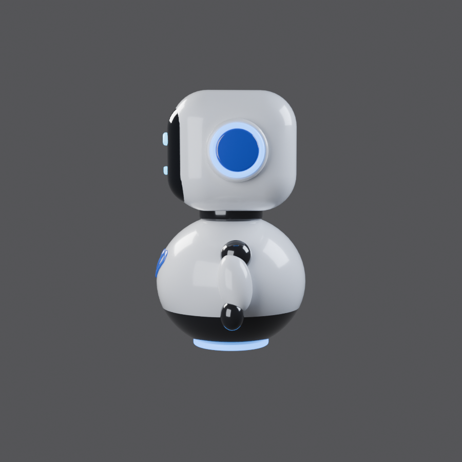
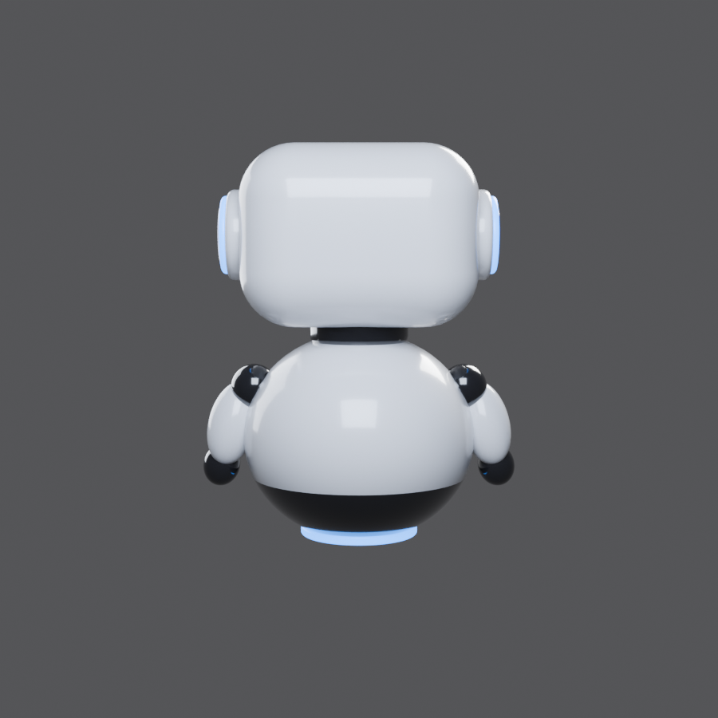

# Robô mascote (Blender)

Script `cute_robot.py` monta o robô por código (testado no Blender 5.0.1):
cabeça arredondada branca, visor preto com olhos e sorriso azuis brilhantes,
"fones" laterais com anel luminoso, corpo esférico com faixa preta, logo azul
no peito, braços e base luminosa. Tudo fica na coleção `CuteRobot`, com o
Empty `CuteRobot_Root` como pai (mova/gire o robô inteiro por ele).

## Como usar

- **Blender MCP**: cole o conteúdo de `cute_robot.py` na ferramenta
  `execute_blender_code` — ele cria o modelo na cena aberta.
- **Blender (GUI)**: aba *Scripting* → *Open* → `cute_robot.py` → *Run Script*.
- **Renderizar as 4 vistas** (frente, 3/4, lado, costas):

  ```
  blender -b -P blender/cute_robot.py -- --render blender/renders/robot
  ```

Rodar o script de novo recria o robô (a coleção é limpa antes).

| Frente | 3/4 | Lado | Costas |
|---|---|---|---|
|  |  |  |  |
