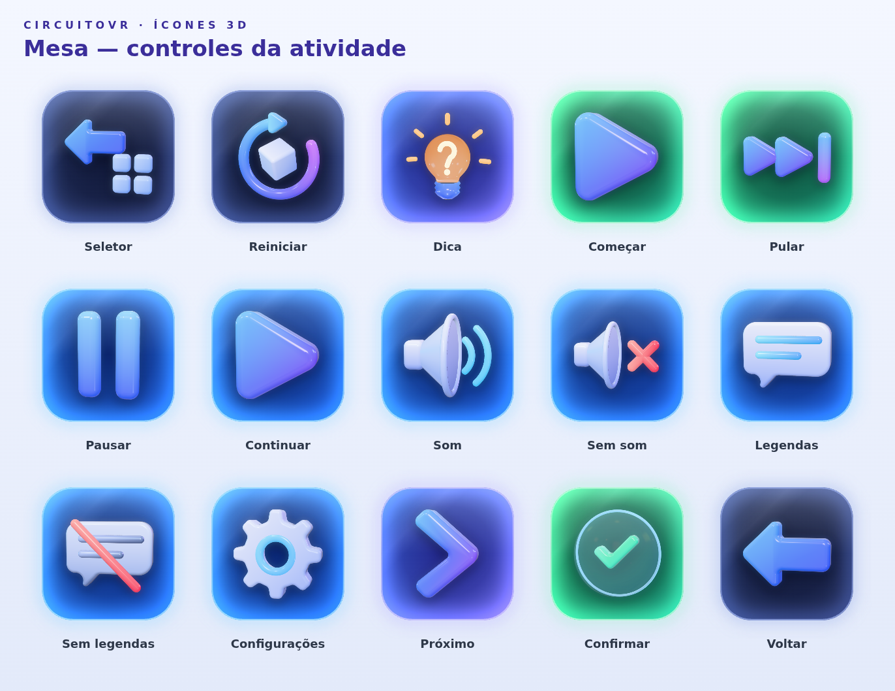

# CircuitoVR: ícones 3D com hover (three.js → Unity)

Kit de ícones e botões da UI do CircuitoVR, feito a partir do inventário de
26/09/2026 (`AppHUD`, seletor, placa da missão, tutorial, resultado). Cada ícone
é um **modelo 3D de verdade** montado em three.js; a mesma fonte gera:

- **PNG para UI** (idle e hover, 512 px, fundo transparente);
- **flipbook do hover** (folha 4×4, 256 px por quadro) com uma micro-animação
  própria por ícone;
- **placas de vidro** por estilo e estado (normal, hover, pressionado,
  desabilitado) + halo separado, com bordas de 9-slice;
- **17 botões prontos** (placa + ícone) nos 4 estados;
- **GLB** de cada ícone com o clipe de animação `hover` embutido;
- **scripts Unity** para o hover (UI e 3D) e para configurar a importação.



## Ideia do hover

No VR o hover precisa dizer "isso é tocável" sem texto. Por isso cada ícone:

1. **sai do vidro** em direção ao usuário (profundidade real no Canvas world-space);
2. **inclina para o ponto do raio**, como se olhasse para a mão;
3. **acende** (emissão e halo mais fortes);
4. toca uma **micro-animação que explica a ação**:

| Ícone | Micro-animação |
| --- | --- |
| Dica (lâmpada) | raios pulsam, "?" brilha, balanço leve |
| Reiniciar | anel dá uma volta, cubo gira 90° |
| Seletor | seta recua, blocos da grade pulsam em sequência |
| Pausar | barras "respiram" alternadas |
| Começar / Continuar / Próximo | empurrão para frente |
| Pular | triângulos avançam em sequência |
| Som | ondas saem do alto-falante |
| Sem som | o × balança |
| Legendas | linhas são "digitadas" de novo |
| Configurações | engrenagem gira um dente |
| Confirmar | ✓ salta dentro da bolha |
| Mão (passo 2) | fecha e abre (gesto de pegar) |
| Alvo (passo 1) | anéis ondulam |
| Estrela | gira no eixo Y |
| Bloqueado | a argola abre e o cadeado treme |

Todas as animações começam e terminam na pose de repouso, então o laço não "pula"
ao entrar ou sair do hover.

## Estrutura

```
ui-vr/
  showcase.html            vitrine interativa (hover, toggles, confirmação em 2 toques)
  export.html              página usada pelo exportador
  src/
    kit3d.js               paleta, materiais (gel, vidro fosco, ouro, luz, vidro) e geometria
    icons.js               catálogo: geometria + micro-animação de cada ícone
    stage.js               luzes, render com transparência, flipbook e exportação GLB
    plates.js              placas de vidro (canvas 2D), botões compostos e previews
  tools/
    export.mjs             Playwright + Chromium headless → arquivos do kit
    manifest.mjs           quais placas, botões e previews gerar
  preview/                 folhas de conferência com rótulos
  Unity/CircuitoVR_IconKit/  ← copie esta pasta para Assets/
```

## Catálogo

| id | Uso no app (inventário) |
| --- | --- |
| `selector` | Seletor (mesa) |
| `back` / `prev` | Voltar, seta ‹ |
| `restart` | Reiniciar / Nova sessão; tutorial "girar o disco" |
| `bulb` | Dica |
| `play` | Começar, Continuar |
| `skip` | Pular |
| `pause` | Pausar |
| `sound` / `muted` | Som / Sem som |
| `subtitles` / `subtitles_off` | Legendas / Sem legendas |
| `settings` | Configurações |
| `next` | Próximo, seta › do Iniciar |
| `confirm` | Confirmar |
| `star` / `star_off` | placar e estrelas do resultado |
| `target`, `hand`, `check` | passos 1, 2 e 3 do "Como jogar" |
| `lock` | Em breve / indisponível |
| `cube`, `axes` | catálogo (`SessionIcon.Cube`, `Axes`) |
| `illus_coord`, `illus_balance`, `illus_soon` | ilustrações dos cards do seletor |

Estilos de placa: `control` (vidro azul), `primary` (degradê da marca), `quiet`
(vidro escuro), `success` (verde), `danger` (o "Confirmar?" das ações
destrutivas), `violet`, `warning` (selo EM BREVE) e `neutral`.

Botões compostos (`Sprites/Buttons/<nome>_<estado>.png`): `btn_seletor`,
`btn_seletor_confirmar`, `btn_reiniciar`, `btn_reiniciar_confirmar`, `btn_dica`,
`btn_comecar`, `btn_pular`, `btn_pausar`, `btn_continuar`, `btn_som`,
`btn_sem_som`, `btn_legendas`, `btn_sem_legendas`, `btn_configuracoes`,
`btn_proximo`, `btn_confirmar`, `btn_voltar`.

## No Unity

Requisitos: Unity 2021.2+ (usa `IPointerMoveHandler`), uGUI, e o pacote
**glTFast** (`com.unity.cloud.gltfast`) só se for usar os GLB.

1. Copie `Unity/CircuitoVR_IconKit` para `Assets/`. O `IconKitImporter`
   configura sozinho as texturas: Sprite, alpha como transparência, mipmaps
   trilinear (evita cintilar no headset) e as bordas de 9-slice das placas
   (`square` 148, `pill` 104, `card` 100, `badge` 56 px).
2. **Botão de UI com hover 3D** (recomendado para a mesa):
   ```
   BTN_Dica            Image (square_primary_normal) + Button + VRIconButton
     Glow              Image (square_primary_glow), raycast off
     Icon              RawImage (bulb_idle), raycast off
     Label             TextMeshProUGUI "Dica"   (opcional)
   ```
   No `VRIconButton`, preencha as 4 placas (`square_primary_*`), o `Icon idle`
   (`bulb_idle`) e o `Icon Hover Sheet` (`bulb_hover_sheet`). Para o rótulo
   dentro da placa, suba o `Icon` ~12% e deixe o texto embaixo.
   - Toggles: chame `SetIcon(pause_idle, pause_hover_sheet)` ↔
     `SetIcon(play_idle, play_hover_sheet)` no clique.
   - "Confirmar?" (Seletor/Reiniciar no meio da sessão): `SetPlate(...)` com as
     placas `square_danger_*` no 1º toque e volte depois de 3 s.
3. **Só sprites, sem script**: use `Sprites/Buttons/btn_*` com Transition =
   Sprite Swap (normal / hover = Highlighted / pressed / disabled).
4. **Ícone 3D real** (`Models/*.glb`): arraste o GLB para a cena dentro de um
   objeto com `VRIcon3D` + um Collider. Os modelos têm ~8,5 cm e a frente virada
   para −Z (como um Quad). Para o clipe `hover` tocar, importe o GLB com
   *Animation Method = Legacy* (o script também aceita Animator com bool
   `Hover`). Com XR Interaction Toolkit, ligue Hover Entered/Exited de um
   `XRSimpleInteractable` a `HoverEnter()`/`HoverExit()`.

Materiais dos GLB: cor por vértice (os degradês), clearcoat, iridescência e
emissão saem como extensões glTF; o glTFast lê todas. Se preferir URP Lit puro,
use um shader que multiplique a cor do vértice.

## Regerar ou editar

```
cd ui-vr/tools
npm install                 # three + playwright (usa o Chromium do sistema se houver)
node export.mjs             # tudo (~3 min)
node export.mjs --only bulb,settings   # só alguns ícones
node export.mjs --quick --out /tmp/x   # só idle/hover, para iterar rápido
```

Para ver a vitrine localmente, sirva a pasta `ui-vr/` (ex.:
`npx serve ui-vr`) e abra `showcase.html`; o three.js vem do jsDelivr.

Para criar um ícone novo, adicione uma entrada em `src/icons.js` com
`build()` devolvendo `{ root, anim(t) }`. Regras: modele no plano XY de frente
para +Z, dê nome único a cada peça animada (vira nó e trilha no GLB) e faça
`anim(0)` ser a pose de repouso.
